# PERC Admission Operations Engine — UML Class Diagram

```mermaid
classDiagram
    class Lead {
        +UUID id
        +String first_name
        +String last_name
        +String phone
        +String email
        +String source
        +String source_reference_id
        +String category
        +String status
        +String classification
        +UUID assigned_to
        +DateTime assigned_at
        +DateTime last_contacted_at
        +String next_scheduled_action
        +JSON metadata
        +Boolean is_active
        +DateTime created_at
        +DateTime updated_at
    }

    class User {
        +UUID id
        +String email
        +String name
        +String role
        +String phone
        +String avatar_url
        +JSON notification_preferences
        +Boolean is_active
        +DateTime created_at
        +DateTime updated_at
    }

    class Course {
        +UUID id
        +String name
        +String description
        +String duration
        +String eligibility
        +String subjects
        +String curriculum
        +String learning_outcomes
        +String batch_timings
        +String faculty
        +String brochure_url
        +String pdf_url
        +Boolean is_active
        +DateTime created_at
    }

    class LeadCourse {
        +UUID lead_id
        +UUID course_id
        +String interest_level
        +String notes
        +DateTime created_at
    }

    class Tag {
        +UUID id
        +String name
        +String color
        +DateTime created_at
    }

    class LeadTag {
        +UUID lead_id
        +UUID tag_id
        +DateTime created_at
    }

    class Channel {
        +UUID id
        +String name
        +String display_name
        +Boolean is_active
        +JSON config
        +DateTime created_at
    }

    class Conversation {
        +UUID id
        +UUID lead_id
        +UUID channel_id
        +String external_conversation_id
        +String status
        +DateTime started_at
        +DateTime ended_at
        +JSON metadata
    }

    class Message {
        +UUID id
        +UUID conversation_id
        +UUID lead_id
        +String direction
        +String channel_message_id
        +String content_type
        +String content
        +UUID template_id
        +JSON metadata
        +DateTime sent_at
        +DateTime delivered_at
        +DateTime read_at
        +String status
    }

    class MessageAttachment {
        +UUID id
        +UUID message_id
        +String file_name
        +String file_url
        +String file_type
        +Integer file_size
        +DateTime created_at
    }

    class EventType {
        +UUID id
        +String name
        +String description
        +String category
        +DateTime created_at
    }

    class TimelineEvent {
        +UUID id
        +UUID lead_id
        +UUID event_type_id
        +String actor_type
        +String actor_id
        +String description
        +JSON metadata
        +DateTime created_at
    }

    class WorkflowInstance {
        +UUID id
        +UUID lead_id
        +String current_state
        +String previous_state
        +Boolean is_paused
        +Boolean is_completed
        +DateTime completed_at
        +JSON metadata
        +DateTime created_at
        +DateTime updated_at
    }

    class WorkflowHistory {
        +UUID id
        +UUID workflow_id
        +UUID lead_id
        +String from_state
        +String to_state
        +String trigger_event
        +String triggered_by
        +String triggered_by_id
        +JSON metadata
        +DateTime created_at
    }

    class AutomationRule {
        +UUID id
        +String name
        +String description
        +String trigger_event
        +String condition_expression
        +String action_definition
        +Integer priority
        +Boolean is_active
        +DateTime created_at
        +DateTime updated_at
    }

    class Promise {
        +UUID id
        +UUID lead_id
        +UUID workflow_id
        +String promise_type
        +String status
        +DateTime scheduled_at
        +DateTime executed_at
        +DateTime cancelled_at
        +String cancelled_reason
        +JSON payload
        +JSON result
        +String error_message
        +Integer retry_count
        +Integer max_retries
        +Boolean is_recurring
        +String recurring_interval
        +DateTime created_at
        +DateTime updated_at
    }

    class PromiseExecution {
        +UUID id
        +UUID promise_id
        +String status
        +DateTime executed_at
        +Integer duration_ms
        +JSON result
        +String error_message
    }

    class Task {
        +UUID id
        +UUID lead_id
        +UUID assigned_to
        +String task_type
        +String title
        +String description
        +String priority
        +String status
        +DateTime due_at
        +DateTime completed_at
        +UUID completed_by
        +String source
        +JSON metadata
        +DateTime created_at
        +DateTime updated_at
    }

    class Meeting {
        +UUID id
        +UUID lead_id
        +UUID organizer_id
        +String meeting_type
        +String status
        +DateTime scheduled_at
        +Integer duration_minutes
        +DateTime completed_at
        +String notes
        +String feedback
        +Integer feedback_rating
        +String cancellation_reason
        +Boolean reminder_sent
        +JSON metadata
        +DateTime created_at
        +DateTime updated_at
    }

    class Document {
        +UUID id
        +String document_type
        +String name
        +String description
        +String file_url
        +String file_type
        +Integer file_size
        +Integer version
        +Boolean is_active
        +JSON metadata
        +DateTime created_at
        +DateTime updated_at
    }

    class Template {
        +UUID id
        +String name
        +String template_type
        +UUID channel_id
        +String content
        +String variables
        +String language
        +Integer version
        +Boolean is_active
        +String category
        +JSON metadata
        +DateTime created_at
        +DateTime updated_at
    }

    class Admission {
        +UUID id
        +UUID lead_id
        +UUID student_id
        +UUID course_id
        +String status
        +DateTime admission_date
        +Boolean documents_verified
        +Boolean fee_paid
        +Float total_fee
        +Float discount_amount
        +String discount_reason
        +String payment_plan
        +String notes
        +JSON metadata
        +DateTime created_at
        +DateTime updated_at
    }

    class Student {
        +UUID id
        +UUID lead_id
        +UUID admission_id
        +String first_name
        +String last_name
        +String phone
        +String email
        +DateTime date_of_birth
        +String address
        +UUID course_id
        +String batch
        +String enrollment_number
        +String status
        +JSON documents
        +JSON metadata
        +DateTime created_at
        +DateTime updated_at
    }

    class Notification {
        +UUID id
        +UUID user_id
        +UUID lead_id
        +String notification_type
        +String title
        +String message
        +Boolean is_read
        +DateTime read_at
        +String action_url
        +String priority
        +JSON metadata
        +DateTime created_at
    }

    class AnalyticsEvent {
        +UUID id
        +UUID lead_id
        +String event_type
        +JSON event_data
        +String source
        +DateTime created_at
    }

    class Setting {
        +UUID id
        +String key
        +String value
        +String description
        +String category
        +Boolean is_editable
        +DateTime created_at
        +DateTime updated_at
    }

    class AuditLog {
        +UUID id
        +String table_name
        +String record_id
        +String action
        +String old_values
        +String new_values
        +UUID changed_by
        +String ip_address
        +DateTime changed_at
    }

    class FAQ {
        +UUID id
        +String question
        +String answer
        +String category
        +Boolean is_active
        +DateTime created_at
        +DateTime updated_at
    }

    class Branch {
        +UUID id
        +String name
        +String address
        +String google_maps_link
        +String contact_number
        +String working_hours
        +String branch_manager
        +String parking_info
        +String nearby_landmarks
        +Boolean is_active
        +DateTime created_at
    }

    %% ── Relationships ─────────────────────────────────────────────────

    Lead "1" --> "0..*" LeadCourse : has
    Lead "1" --> "0..*" LeadTag : tagged
    Lead "1" --> "0..1" WorkflowInstance : owns
    Lead "1" --> "0..*" Conversation : communicates
    Lead "1" --> "0..*" Message : sends
    Lead "1" --> "0..*" TimelineEvent : logs
    Lead "1" --> "0..*" Promise : schedules
    Lead "1" --> "0..*" Task : needs
    Lead "1" --> "0..*" Meeting : attends
    Lead "1" --> "0..1" Admission : converts
    Lead "1" --> "0..1" Student : becomes
    Lead "1" --> "0..*" Notification : triggers
    Lead "1" --> "0..*" AnalyticsEvent : generates

    User "1" --> "0..*" Lead : assigned
    User "1" --> "0..*" Task : assigned
    User "1" --> "0..*" Meeting : organizes
    User "1" --> "0..*" Notification : receives
    User "1" --> "0..*" AuditLog : performs

    Course "1" --> "0..*" LeadCourse : enrolled
    Course "1" --> "0..*" Admission : targets
    Course "1" --> "0..*" Student : studies

    Tag "1" --> "0..*" LeadTag : classifies

    Channel "1" --> "0..*" Conversation : hosts
    Channel "1" --> "0..*" Template : belongs_to

    Conversation "1" --> "0..*" Message : contains

    Message "1" --> "0..*" MessageAttachment : attaches
    Message "1" --> "0..1" Template : uses

    EventType "1" --> "0..*" TimelineEvent : categorizes

    WorkflowInstance "1" --> "0..*" WorkflowHistory : tracks
    WorkflowInstance "1" --> "0..*" Promise : triggers
    WorkflowInstance "1" --> "0..*" Task : generates
    WorkflowInstance "1" --> "0..*" AnalyticsEvent : emits

    Promise "1" --> "0..*" PromiseExecution : executes

    Admission "1" --> "0..1" Student : produces
    Student "1" --> "0..1" Admission : belongs_to

    Template "1" --> "0..1" Message : formats
```



## Aggregate Root: Lead

```
Lead (Aggregate Root)
├── LeadCourse (interested courses)
├── LeadTag (classification tags)
├── WorkflowInstance (1:1 — active lifecycle)
│   ├── WorkflowHistory (state transitions)
│   └── Promise (scheduled future actions)
│       └── PromiseExecution (execution log)
├── Conversation (per channel)
│   └── Message (inbound/outbound)
│       └── MessageAttachment (files)
├── TimelineEvent (immutable event log)
├── Task (pending human actions)
├── Meeting (calls, demos, meetings)
├── Admission (1:1 — enrollment)
│   └── Student (post-admission record)
└── Notification (internal alerts)
```

## Domain Modules

| Module | Tables | Engine |
|---|---|---|
| Lead Management | `leads`, `lead_courses`, `tags`, `lead_tags` | Lead Capture Engine |
| Communication | `channels`, `conversations`, `messages`, `message_attachments`, `templates`, `faqs`, `branches` | Response Template Engine |
| Workflow | `workflow_instances`, `workflow_history`, `automation_rules` | Workflow Engine |
| Scheduling | `promises`, `promise_executions` | Scheduler Engine (Promise Engine) |
| Timeline | `event_types`, `timeline_events` | Conversation Timeline Engine |
| Tasks | `tasks` | Follow-up Engine |
| Meetings | `meetings` | Call & Meeting Coordination Engine |
| Notifications | `notifications` | Notification Engine |
| Analytics | `analytics_events` | Analytics Engine |
| Admissions | `admissions` | Admission Engine |
| Students | `students` | Student Enrollment Engine |
| Documents | `documents` | Document Management |
| System | `users`, `settings`, `audit_logs` | Automation Orchestrator |

## Lead State Machine

```
NEW ──> INFORMATION_SHARED ──> WAITING ──> INTERESTED ──> CALL_SCHEDULED
                                                              │
                                                              ▼
                                                     MEETING_COMPLETED
                                                              │
                                                              ▼
                                                     DEMO_SCHEDULED
                                                              │
                                                              ▼
                                                     ADMISSION_PENDING
                                                              │
                                                              ▼
                                                     ADMITTED ──> CLOSED
                                                              │
                        INACTIVE ──> RECOVERY ──> ADMITTED / LOST / CLOSED
```

## Communication Flow

```
Input Channels                  Output Channel
─────────────                   ──────────────
WhatsApp                            │
Instagram                           │
Facebook                            │
Website Form            ───>    WhatsApp (only)
Website Chat                        │
Email                               │
Phone / Walk-in                     │
```