```mermaid
erDiagram

    %% ===================== CORE ENTITIES =====================
    USERS {
        string id PK
        string email UK
        string name
        string role
        string phone
        string is_active
    }

    LEADS {
        string id PK
        string first_name
        string last_name
        string phone
        string email
        string source
        string status
        string classification
        string assigned_to FK
    }

    COURSES {
        string id PK
        string name
        string duration
        string eligibility
    }

    TAGS {
        string id PK
        string name UK
        string color
    }

    CHANNELS {
        string id PK
        string name UK
        string display_name
    }

    %% ===================== JUNCTION TABLES =====================
    LEAD_COURSES {
        string lead_id PK,FK
        string course_id PK,FK
        string interest_level
    }

    LEAD_TAGS {
        string lead_id PK,FK
        string tag_id PK,FK
    }

    %% ===================== CONVERSATION / MESSAGING =====================
    CONVERSATIONS {
        string id PK
        string lead_id FK
        string channel_id FK
        string status
    }

    MESSAGES {
        string id PK
        string conversation_id FK
        string lead_id FK
        string template_id FK
        string direction
        string content_type
        string content
    }

    MESSAGE_ATTACHMENTS {
        string id PK
        string message_id FK
        string file_name
        string file_url
    }

    TEMPLATES {
        string id PK
        string name
        string template_type
        string channel_id FK
        string content
    }

    %% ===================== TIMELINE / WORKFLOW =====================
    EVENT_TYPES {
        string id PK
        string name UK
        string category
    }

    TIMELINE_EVENTS {
        string id PK
        string lead_id FK
        string event_type_id FK
        string actor_type
        string description
    }

    WORKFLOW_INSTANCES {
        string id PK
        string lead_id FK,UK
        string current_state
        string previous_state
    }

    WORKFLOW_HISTORY {
        string id PK
        string workflow_id FK
        string lead_id FK
        string from_state
        string to_state
    }

    AUTOMATION_RULES {
        string id PK
        string name
        string trigger_event
        string is_active
    }

    %% ===================== PROMISE ENGINE =====================
    PROMISES {
        string id PK
        string lead_id FK
        string workflow_id FK
        string promise_type
        string status
        string scheduled_at
    }

    PROMISE_EXECUTIONS {
        string id PK
        string promise_id FK
        string status
        string executed_at
    }

    %% ===================== TASKS / MEETINGS =====================
    TASKS {
        string id PK
        string lead_id FK
        string assigned_to FK
        string completed_by FK
        string task_type
        string status
    }

    MEETINGS {
        string id PK
        string lead_id FK
        string organizer_id FK
        string meeting_type
        string status
        string scheduled_at
    }

    %% ===================== ADMISSIONS / STUDENTS =====================
    ADMISSIONS {
        string id PK
        string lead_id FK,UK
        string student_id FK
        string course_id FK
        string status
    }

    STUDENTS {
        string id PK
        string lead_id FK,UK
        string admission_id FK
        string course_id FK
        string first_name
        string enrollment_number UK
    }

    %% ===================== SUPPORTING ENTITIES =====================
    DOCUMENTS {
        string id PK
        string document_type
        string name
        string file_url
    }

    NOTIFICATIONS {
        string id PK
        string user_id FK
        string lead_id FK
        string notification_type
        string title
    }

    ANALYTICS_EVENTS {
        string id PK
        string lead_id FK
        string event_type
    }

    SETTINGS {
        string id PK
        string key UK
        string value
    }

    AUDIT_LOGS {
        string id PK
        string table_name
        string record_id
        string action
        string changed_by FK
    }

    FAQS {
        string id PK
        string question
        string answer
        string category
    }

    BRANCHES {
        string id PK
        string name
        string address
    }

    %% ===================== RELATIONSHIPS =====================
    USERS ||--o{ LEADS               : "assigned to"
    USERS ||--o{ TASKS                : "assigned to"
    USERS ||--o{ TASKS                : "completed by"
    USERS ||--o{ MEETINGS             : "organizes"
    USERS ||--o{ NOTIFICATIONS        : "receives"
    USERS ||--o{ AUDIT_LOGS           : "performs"

    LEADS ||--o{ LEAD_COURSES         : "interested in"
    COURSES ||--o{ LEAD_COURSES       : "linked to"

    LEADS ||--o{ LEAD_TAGS            : "tagged with"
    TAGS ||--o{ LEAD_TAGS             : "applied to"

    LEADS ||--o{ CONVERSATIONS        : "has"
    CHANNELS ||--o{ CONVERSATIONS     : "used in"

    CONVERSATIONS ||--o{ MESSAGES     : "contains"
    LEADS ||--o{ MESSAGES             : "sends/receives"
    TEMPLATES ||--o{ MESSAGES         : "used in"
    MESSAGES ||--o{ MESSAGE_ATTACHMENTS : "has"
    CHANNELS ||--o{ TEMPLATES         : "belongs to"

    LEADS ||--o{ TIMELINE_EVENTS      : "has"
    EVENT_TYPES ||--o{ TIMELINE_EVENTS : "categorizes"

    LEADS ||--|| WORKFLOW_INSTANCES   : "drives"
    WORKFLOW_INSTANCES ||--o{ WORKFLOW_HISTORY : "logs"
    LEADS ||--o{ WORKFLOW_HISTORY     : "has"

    LEADS ||--o{ PROMISES             : "has"
    WORKFLOW_INSTANCES ||--o{ PROMISES : "schedules"
    PROMISES ||--o{ PROMISE_EXECUTIONS : "logs"

    LEADS ||--o{ TASKS                : "generates"
    LEADS ||--o{ MEETINGS             : "has"

    LEADS ||--|| ADMISSIONS           : "results in"
    COURSES ||--o{ ADMISSIONS         : "admitted to"
    ADMISSIONS ||--|| STUDENTS        : "creates"
    LEADS ||--|| STUDENTS             : "becomes"
    COURSES ||--o{ STUDENTS           : "enrolled in"

    LEADS ||--o{ NOTIFICATIONS        : "triggers"
    LEADS ||--o{ ANALYTICS_EVENTS     : "generates"
```

# PERC Admission Operations Engine — Entity Relationship Diagram

> An ER diagram is a visual map used to design databases by showing **entities**, their **attributes**, and the **relationships** between them. The diagram below mirrors your `PERC` schema using Mermaid's crow's-foot notation (same style as your hockey pool sample image).

## How to view this in VS Code

1. Install the extension **"Markdown Preview Mermaid Support"** (or **"Mermaid Chart"**) from the VS Code marketplace.
2. Open this file in VS Code.
3. Press `Ctrl+Shift+V` (or `Cmd+Shift+V` on Mac) to open the Markdown preview.
4. The diagram below will render automatically.

---

---

## Notation key

- `||--o{` → one-to-many (one record on the left can relate to many on the right)
- `||--||` → one-to-one
- `PK` → Primary Key
- `FK` → Foreign Key
- `UK` → Unique Key

## Entity groups

- **Identity & Access**: `USERS`
- **Core CRM**: `LEADS`, `COURSES`, `TAGS`, `CHANNELS`, `LEAD_COURSES`, `LEAD_TAGS`
- **Messaging**: `CONVERSATIONS`, `MESSAGES`, `MESSAGE_ATTACHMENTS`, `TEMPLATES`
- **Timeline & Workflow Engine**: `EVENT_TYPES`, `TIMELINE_EVENTS`, `WORKFLOW_INSTANCES`, `WORKFLOW_HISTORY`, `AUTOMATION_RULES`
- **Promise Engine (scheduled actions)**: `PROMISES`, `PROMISE_EXECUTIONS`
- **Human Tasks**: `TASKS`, `MEETINGS`
- **Admissions Pipeline**: `ADMISSIONS`, `STUDENTS`
- **Supporting Data**: `DOCUMENTS`, `NOTIFICATIONS`, `ANALYTICS_EVENTS`, `SETTINGS`, `AUDIT_LOGS`, `FAQS`, `BRANCHES`
